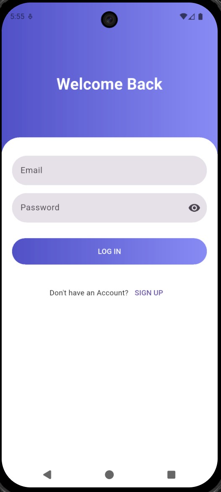
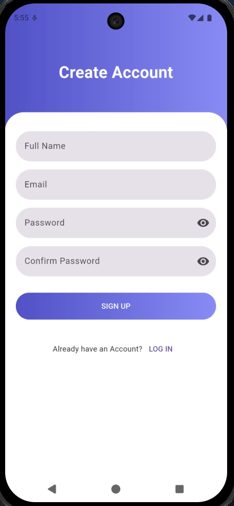
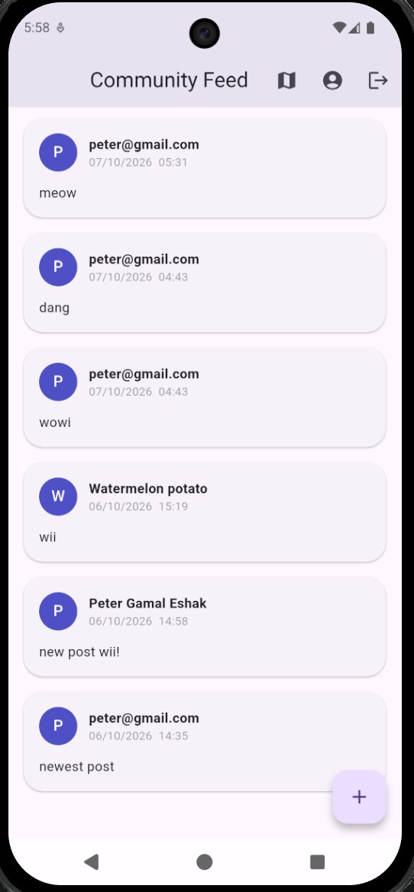
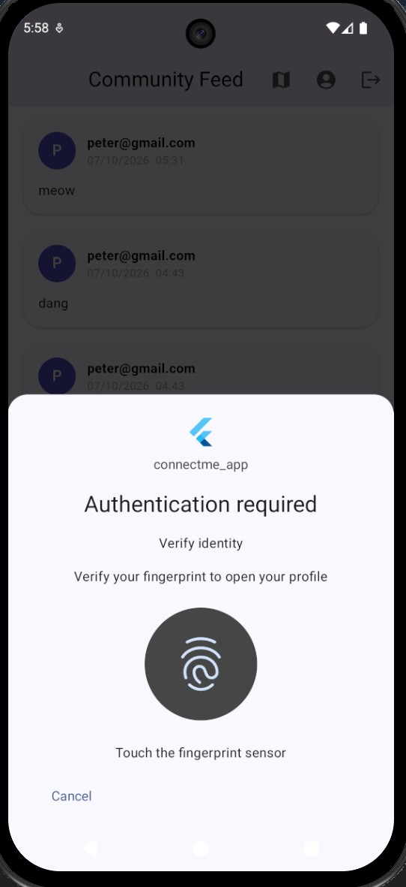
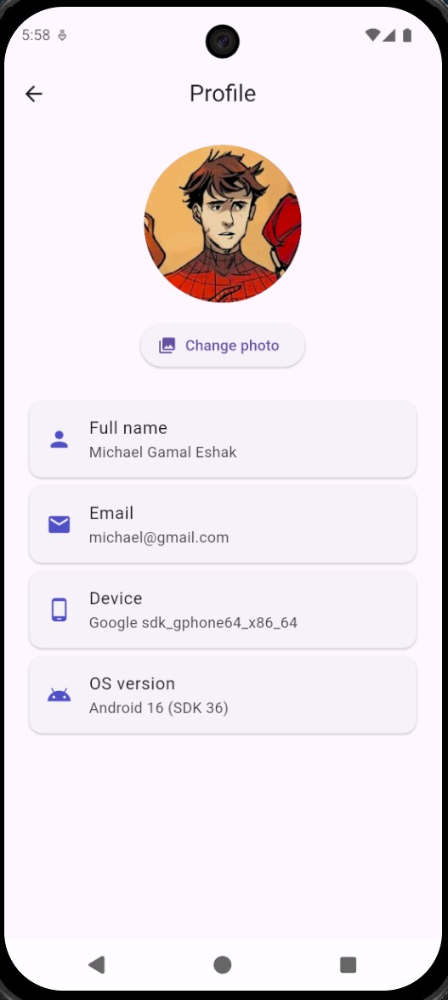
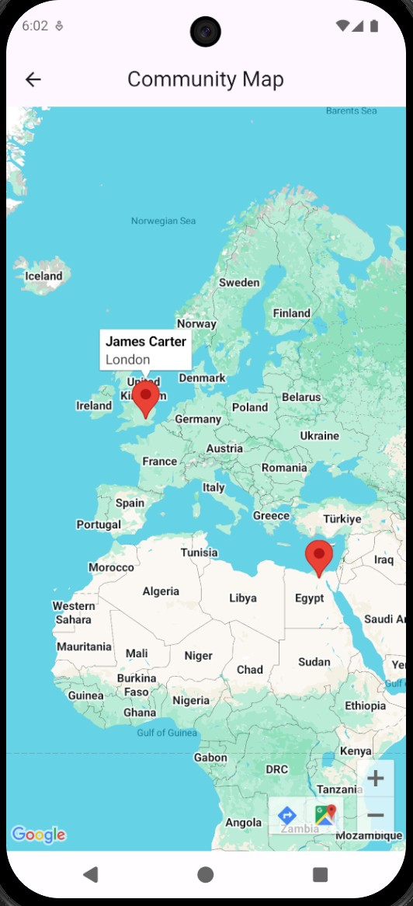
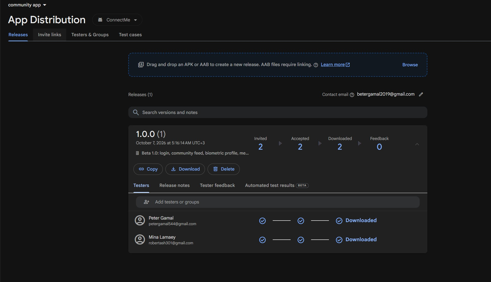
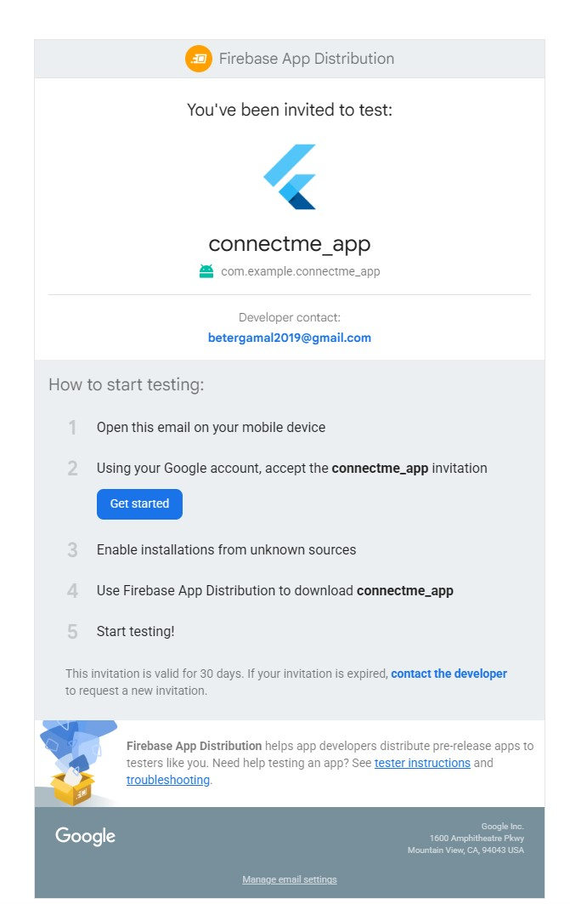

# ConnectMe Community App

ConnectMe is a Flutter social app where members sign up, share posts in a
real-time community feed, manage a biometric-protected profile, and see fellow
members on a map. It is built with Firebase and Clean Architecture.

## Screenshots

<table>
  <tr>
    <td align="center"><b>Login</b> </td>
    <td align="center"><b>Sign Up</b> </td>
    <td align="center"><b>Home Feed</b> </td>
  </tr>
  <tr>
    <td align="center"><b>Biometric Prompt</b> </td>
    <td align="center"><b>Profile</b> </td>
    <td align="center"><b>Community Map</b> </td>
  </tr>
</table>

## Features

- Email and password login and sign up (Firebase Auth) with form validation
- Persistent sign-in: returning users skip the login screen
- Real-time community feed backed by Cloud Firestore, with an offline cache
- Create posts with a floating action button
- Fingerprint check before the profile opens
- Profile screen with photo (picked from the gallery and stored in Firestore),
  full name, email, device model and OS version
- Community Map (Google Maps) with member markers and info windows

## Tech stack

Flutter and Dart, Firebase Auth, Cloud Firestore, Firebase App Distribution,
flutter_bloc (Cubit), GetIt, image_picker, google_maps_flutter, local_auth,
device_info_plus and shared_preferences.

## Architecture

The project follows Clean Architecture with three layers. Each layer only
depends on the one below it.

    lib/
    ├── main.dart
    ├── injection.dart          GetIt dependency injection
    ├── core/errors/            Failure classes with user-friendly messages
    ├── domain/                 Entities, repository contract, use cases (no Firebase code)
    ├── data/                   Models, data sources, repository implementation
    ├── presentation/           Cubits, screens and widgets
    └── services/               Auth, Firestore and biometric services

**Example flow (creating a post):**
HomeScreen, then PostCubit, then the CreatePost use case, then PostRepository,
which is implemented by PostRepositoryImpl, then FirestorePostDataSource, then
FirestoreService, and finally Cloud Firestore.

### Design patterns

| Pattern | Where | Why |
|---|---|---|
| Singleton | `FirestoreService` | One shared Firestore connection for the whole app |
| Factory | `PostRepositoryImpl._createDataSource` | Chooses the remote (Firestore) or local (cache) data source |
| Builder | `UserModelBuilder` | Builds the user step by step, setting only the fields that are available |

## Permissions

| Permission | Why it is needed |
|---|---|
| `INTERNET` | Firebase and Google Maps need network access |
| `USE_BIOMETRIC` | Fingerprint check before the profile opens |

The gallery picker uses the system photo picker, so no storage permission is needed.

## Getting started

1. Clone the repository and run `flutter pub get`.
2. Add your own `android/app/google-services.json` from your Firebase project.
3. Add your Google Maps key to `android/local.properties`:
   `MAPS_API_KEY=your_key_here`
4. Run `flutter run`.

## Beta distribution (Firebase App Distribution)

1. Build the release APK: `flutter build apk --release`
2. Open the Firebase console, then Release & Monitor, then App Distribution,
   and select the `com.example.connectme_app` app.
3. Upload `build/app/outputs/flutter-apk/app-release.apk`.
4. Add two testers by email, write the release notes, and press Distribute.
5. Each tester received the invitation email, accepted it and installed the build.

The dashboard shows the uploaded release with both testers marked Downloaded:

The invitation email the testers received:

## Author

Your Name · [GitHub](https://github.com/Potater420)